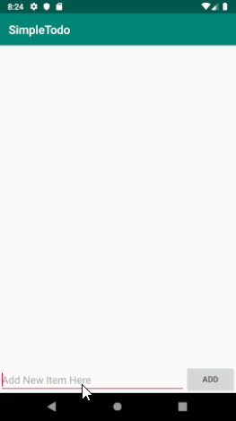

# Pre-work - CodePath TodoApp

**Simple Todo** is an android app that allows building a todo list and basic todo items management functionality including adding new items, editing and deleting an existing item.

Submitted by: **Ivan Gonzalez**

Time spent: **10** hour(s) spent in total

## User Stories

The following **required** functionality is completed:

* [x] User can **successfully add and remove items** from the todo list
* [ ] User can **tap a todo item in the list and bring up an edit screen for the todo item** and then have any changes to the text reflected in the todo list.
* [x] User can **persist todo items** and retrieve them properly on app restart

The following **optional** features are implemented:

* [ ] Persist the todo items [into SQLite](http://guides.codepath.com/android/Persisting-Data-to-the-Device#sqlite) instead of a text file
* [ ] Improve style of the todo items in the list [using a custom adapter](http://guides.codepath.com/android/Using-an-ArrayAdapter-with-ListView)
* [ ] Add support for completion due dates for todo items (and display within listview item)
* [ ] Use a [DialogFragment](http://guides.codepath.com/android/Using-DialogFragment) instead of new Activity for editing items
* [ ] Add support for selecting the priority of each todo item (and display in listview item)
* [ ] Tweak the style improving the UI / UX, play with colors, images or backgrounds

The following **additional** features are implemented:

* [ ] User can search for task items by keywords in the name
* [ ] User can sort task items by due date, priority
* [ ] Splash Screen while the app loads/configures itself (DBFlow) on slower devices

## Video Walkthrough 

Here's a walkthrough of implemented user stories:

GIF created with [LiceCap](http://www.cockos.com/licecap/).

## Notes
<--
I planned on completing a whole number of other design ideas that I have but I had no time/ran short:

* Use material design's floating action button style to allow for creation of new task items (promoted action)
* Use an icon (eg. exclamation or bell) and colored vertical line to signify overdue task items
* Allow users to set optional reminders for task items in the list
* Human readable dates (ex. Today, Tomorrow, Yesterday, This Month, Next Month, x Days from Now, n Months from Now etc.)
* Tabbed activity view to separate/segragate items either by priority, due date or completed/incomplete/archived
* Tindr-like take on ToDos with a swipeable UX for done/not-done items (aka Listr)
* Connect to some simple backend server (like Firebase) to persist a user's todo tak items across multiple devices (with a unique ID such as a set of login credentials)

DBFlow was also slightly tricky to work with, especially when changing the type for a column the app needed to be recompiled before it would pick up the changes (for autocomplete) when writing out the syntax for SQL queries etc.

Given more time, I would have probably also restructured/refactored my app into a few different packages, and identified several places where I could have easily promoted code reusability using modern OOP concepts and design patterns like abstraction, data encapsulation and polymorphism.

Lastly, getting the right icons was a challenge, and layouts were not always easy to work with.

Finally, I would have also liked to include at least some rudimentary/basic testing. I spent a lot of time debugging my app and manually testing edge-cases and corner conditions.
!-->

## License

    Copyright 2019 Ivan Gonzalez

    Licensed under the Apache License, Version 2.0 (the "License");
    you may not use this file except in compliance with the License.
    You may obtain a copy of the License at

        http://www.apache.org/licenses/LICENSE-2.0

    Unless required by applicable law or agreed to in writing, software
    distributed under the License is distributed on an "AS IS" BASIS,
    WITHOUT WARRANTIES OR CONDITIONS OF ANY KIND, either express or implied.
    See the License for the specific language governing permissions and
    limitations under the License.
